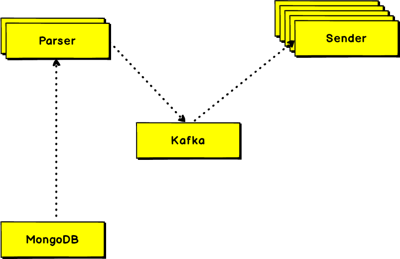

<p align="center">
  
</p>


# Overview

Simple, scalable web push service backend, written in node.js. The architecture is also simple,
this application is consist of two microservices.

1. Parser - Prepare & format push data for sending.
2. Sender - Responsible for sending push to the user's device.

It can send push notifications to any VAPID supported browser.

Completely decoupled service, you can easily add several service instances or remove
services that you don't need. It will be auto balanced after adding or removing an instance.

## How it works

This application is based on `Apache Kafka.` The parser service will always listen for a push on `raw-push` topic
and when it gets a push, it starts processing subscriber details from a MongoDB read stream. After preparing push
with subscriber's data, it will send to another topic `push`, where sender service is listening. The sender will
transfer pushes to subscriber's devices by using web-push protocol.

## Enough talk, How to run this?

### Step 1: Installation

```bash
git clone git@github.com:joynal/pushservice.git
cd pushservice
npm i
npm install -g pm2
```

I've included a docker-compose file in the root directory, so that you can test locally first. You can run the following command to start the service:

```bash
docker-compose up
```

### Step 2: Create Kafka topics

- create `push` with 200 partitions
- create `raw-push` with 4 partitions

### Step 3: Setup environment variables

Copy `.env.example` to `.env` and replace `.env` configurations.

### Step 4: Generate dummy data

Generate site:
```bash
node seed/generateSite.js
```

Copy site id then generate push & subscribers:
```bash
node seed/seed/generatePush.js [siteId]
node seed/generateSubscribers.js [siteId] [number of subscribers]
```

### Step 5: Server tweak

Increase your open file limits:
```bash
ulimit -n 1000000
ulimit -S 1000000
```

### Step 6: Start services

parser:
```bash
node src/parser.js
```

sender:
```bash
node src/sender.json
```

### Step 7: Send a push notification

```bash
node cmd/send.js [pushId]
```

## Issues to work with

Some issue may arise when you try to send a large number of pushes(1 Million or more). Which is not related to this application; it depends on your OS and node.js configurations and number of sender servers. Under high load node.js drop connections,
till 500k-600k push is ok without any issues(When I tested). Must increase your OS open file limits & maximize bandwidth if possible.
An increasing number of sender servers can balance the load & will remove these errors.

Errors may encounter under high load:
- Client network socket disconnected before secure TLS connection was established
- Connect EADDRNOTAVAIL 108.177.111.95:443 - Local (10.128.0.5:0)
- read ECONNRESET
- socket hang up

## Benchmarks

The service is tested with generated fake push subscriptions.

Kafka:
  - used cloudkarafka's BOUNCING BAT plan
  - raw-push - 4 partitions
  - push - 200 partitions.

Servers:
  - Google compute engine.
  - Parser - 1 server 4GB Memory, 2 core, first-generation - 2 parser instances, 1 used.
  - Sender - 8 servers 8GB Memory, 4 core, first-generation - 32 sender instances, all used.

1 Million push took:
  - 3min, 10sec - first time
  - 2min, 42sec - second time
  - 2min, 31sec - third time
  - 3min, 15sec - fourth time

## Extras

All necessary server setup commands added on `setup.sh` file.

## Need sponsors

If anyone can sponsor me servers for load testing, I will optimize it further and will add all the necessary resources.

## License

This project is licensed under the MIT License - see the [license.md](./license.md) file for details

## Thanks

[Cloudkarafka](https://cloudkarafka.com) & [Cloudclusters](https://cloudclusters.io) for providing a free trail.
